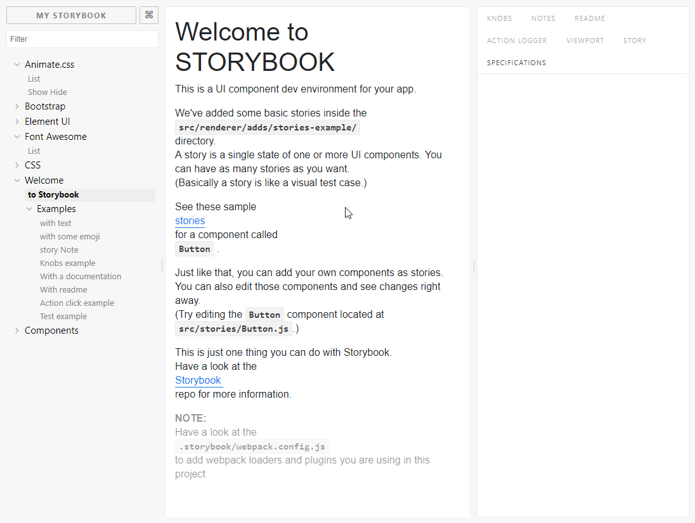
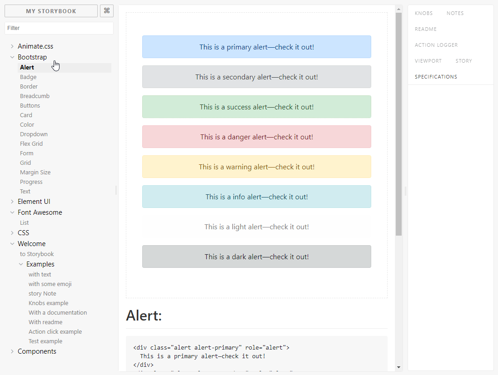
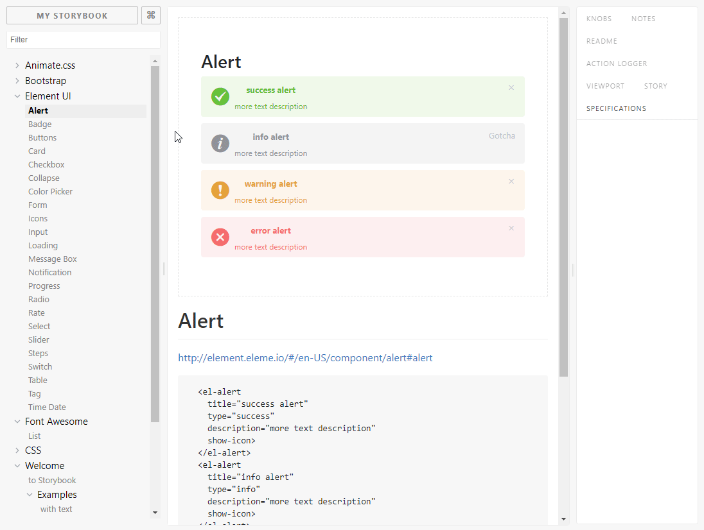
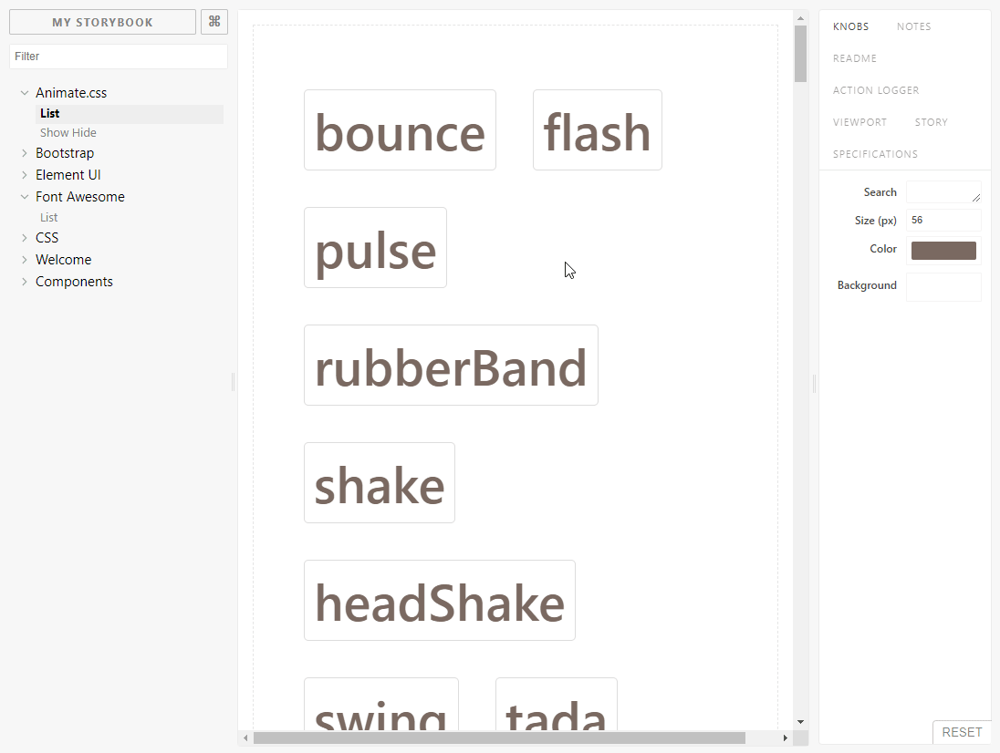
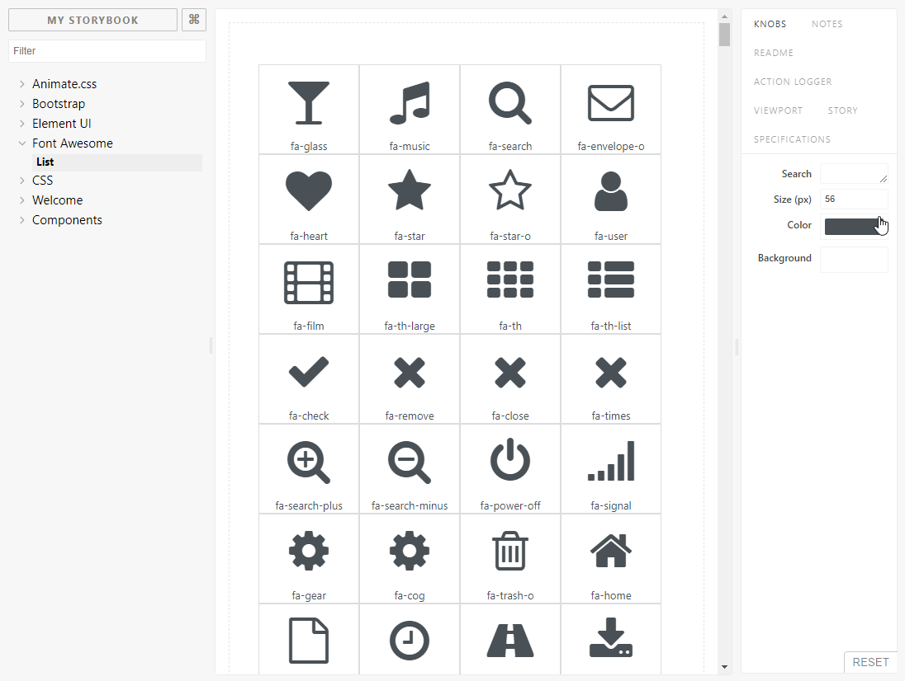
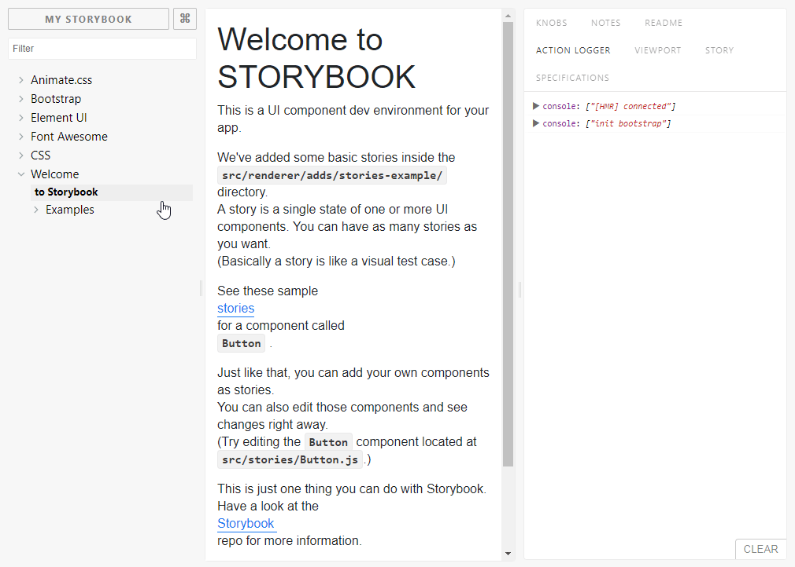
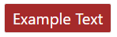

<div align="center">
<br>

<br>
<br>
</div>

<p align="center" color="#6a737d">
The boilerplate for making electron applications built with vue (pretty much what it sounds like).
</p>

<div align="center">

[](http://forthebadge.com) [](http://forthebadge.com) [](http://forthebadge.com)
</div>

<div align="center">

[](https://github.com/feross/standard)

[](https://semaphoreci.com/simulatedgreg/electron-vue)
</div>

## Overview

### This is a fork of the original electron-vue project with some extrea features like:

* **Storybook** that allows you to preview your components classes, behaviour and much more [more](https://storybook.js.org/)



* **Bootstrap 4.0** with the preview in storybook for most of the futures to preview like buttons, layouts, etc... [more](https://getbootstrap.com/)



* **Element-UI** wich is great framework for desktop applications, and also with a lot of examples from the original page [more](https://storybook.js.org/)




* **Animated.css** with a lot of styles to animate your buttons, text, etc.. [more](https://daneden.github.io/animate.css/)



* **Font-Awesome** - A huge list of free icons.



* **Modular structure** - This is comes from the Atomic Design with ability to create components or other functions like modules meaning one folder is one module and have everything (including tests, storybooks, documentation) in one folder by suffixes. All files can be included in the project by suffixes. 

## Getting Started

This boilerplate was built as a template for [vue-cli](https://github.com/vuejs/vue-cli) and includes options to customize your final scaffolded app. The use of `node@^7` or higher required. electron-vue also officially recommends the [`yarn`](https://yarnpkg.org) package manager as it handles dependencies much better and can help reduce final build size with `yarn clean`.

```bash
# Install vue-cli and scaffold boilerplate
npm install -g vue-cli
vue init alexiej/electron-vue-storybook my-project

# Install dependencies and run your app
cd my-project
yarn # or npm install
yarn run dev # or npm run dev
yarn run storybook # or npm run storybook
```

## Folder Structure

* **.electron-vue** - Builder for electron desktop project
* **.storybook** - Folder to initialize storybook.
* **src** - Main Folder for sources
  * **main** - Main electron js file to create BrowserWindw
  * **renderer** - Main folder for rendering files
    * **adds** - Additional modules with stories or tests like bootstrap/element-ui,font-awesome or animated.css
    * **assets** - Files like additional images, fonts, etc...
    * **components** - List of basic components like buttons, lists, etc...
    * **css** - Style files with _global.scss to load all styles for application
    * **methods** - helpful methods for the application
    * **modules** - List of modules for the application like Content. Each module can have couple types of files depends on suffix.
    * **App.vue** - main view for BrowserWindow
    * **components.js** - Get all components with the .comp.vue suffix and install them to be available in your application.
    * **main.js** - main .js file to run
    * **mixin.js** - Get all mixins from folder **renderer** with the .mixin.js suffix.
    * **router.js** - Get all routes from the folder **renderer** with the suffix .routes.js.
    * **store.js** - Get all stores from the folder **renderer** with the suffix .store.js.
* **tests** - Test folder that includes all files with the .spec.js suffix.

## File suffixes

| Suffix        | Example           | Description  |
| ------------- |:-------------:| -----|
| .stories.js     | button.stories.js | Information about stories for storybook  |
| .comp.vue | button-example.comp.vue      | Global atomic component for your project |
| .routes.js     | LandingPage.routes.js      |   Information  about routes for router |
| .mixin.js | LandingPage.mixin.js     | Additional mixin for your project |
| .store.js | LandingPage.store.js      |  Vuex store for your project |
| .spec.js | LandingPage.spec.js      |  Unit test for your project|

### **.stories.js**

All files with the **.stories.js** are included in the storybook automaticly without putting the information in the main folder.

#### indes.stories.js

```js
import Vue from 'vue'
import { storiesOf } from '@storybook/vue'
import MyButton from './MyButton.stories.vue'

const stories = storiesOf('Welcome/Examples', module)
stories.addDecorator(withKnobs)

stories
  .add('with text', () => ({
    components: { MyButton },
    template: '<div class="cd-border" @click="action">Hello Button </div>',
    methods: { action: action('clicked') }
  }))
```

#### mybutton.stories.vue

You can put **.stories.vue** as a suffix to exclude them from code cover test.

```html
<template>
  <button class="button-styles color--red-1 button--40x40" @click="onClick">
    <b> </b>
    Example class of the control
    <slot/>
  </button>
</template>

<script>
export default {
  name: 'my-button',
  data () {
    return {
      messages: ['Cat']
    }
  },
  methods: {
    onClick () {
      this.$emit('click')
      console.log('button clicked')
    }
  }
}
</script>

<style>
.button-styles {
  border: 1px solid #eee;
  border-radius: 3px;
  background-color: #ffffff;
  cursor: pointer;
  font-size: 15pt;
  padding: 3px 10px;
  margin: 10px;
  background: brown;
  color: #fff;
}
</style>
```



### **.comp.vue**

#### ButtonExample.comp.vue

```html
<template>
    <button class="button-styles" >
        <slot/>
  </button>
</template>
<script>
export default {
}
</script>

<style lang="scss" scoped>
.button-styles {
  border: 1px solid #eee;
  border-radius: 3px;
  background-color: #ffffff;
  cursor: pointer;
  font-size: 15pt;
  padding: 3px 10px;
  margin: 10px;
  background: brown;
  color: #fff;
}
</style>
```

Use example:

```html
<button-example >Example Text</button-example>
```



### **.routes.js**

#### LandingPage.routes.js

```js
export default [{
  path: '/',
  name: 'LandingPage',
  component: require('@/modules/LandingPage/LandingPage').default
}]
```

### LandingPageInfo.routes.js

You can specify path of children elements by adding parent to them.

```js
export default [{
  parent: '/',
  path: '/info',
  name: 'Info',
  component: require('@/modules/LandingPage/Info').default
}]
```

### **.mixin.js**

#### LandingPage.mixin.js

```js
export default {
  methods: {
    mixinExample () {
      return 'This method is available everywhere in your project'
    }
  }
}
```

### **.store.js**

#### LandingPage.store.js

```js
export default {
  namespaced: true,
  state: {
    message: 'Welcome to your new project! (store version)'
  },
  mutations: {

  },
  actions: {

  }
}
```

### **.spec.js**

#### LandingPage.spec.js

```js
import Vue from 'vue'
import LandingPage from './LandingPage'
import router from '../../router'

import Vuex from 'vuex'
Vue.use(Vuex)

const storeText = 'Title test'
const store = new Vuex.Store({
  modules: {
    'LandingPage': {
      state: {
        namespaced: true,
        message: storeText
      }
    }
  }
})

describe('LandingPage.vue', () => {
  it('should render correct contents', () => {
    const vm = new Vue({
      el: document.createElement('div'),
      render: h => h(LandingPage),
      store: store,
      router
    }).$mount()

    expect(vm.$el.querySelector('.title').textContent).to.contain(storeText)
  })
})

```


## Other things comes originally from the Electron-Vue

The aim of this project is to remove the need of manually setting up electron apps using vue. electron-vue takes advantage of `vue-cli` for scaffolding, `webpack` with `vue-loader`, `electron-packager` or `electron-builder`, and some of the most used plugins like `vue-router`, `vuex`, and so much more.

#### Check out the detailed documentation [here](https://simulatedgreg.gitbooks.io/electron-vue/content/index.html).

Things you'll find in this boilerplate...

* Basic project structure with a **single** `package.json` setup
* Detailed [documentation](https://simulatedgreg.gitbooks.io/electron-vue/content/)
* Project scaffolding using [vue-cli](https://github.com/vuejs/vue-cli)
* Ready to use Vue plugins \([axios](https://github.com/mzabriskie/axios), [vue-electron](https://github.com/SimulatedGREG/vue-electron), [vue-router](https://github.com/vuejs/vue-router), [vuex](https://github.com/vuejs/vuex)\)\*
* Installed [vue-devtools](https://github.com/vuejs/vue-devtools) and [devtron](https://github.com/electron/devtron) tools for development
* Ability to easily package your electron app using [electron-packager](https://github.com/electron-userland/electron-packager) or [electron-builder](https://github.com/electron-userland/electron-builder)\*
* `appveyor.yml` and `.travis.yml` configurations for automated deployments with [electron-builder](https://github.com/electron-userland/electron-builder)\*
* Ability to produce web output for browsers
* Handy [NPM scripts](https://simulatedgreg.gitbooks.io/electron-vue/content/en/npm_scripts.html)
* Use of [webpack](https://github.com/webpack/webpack) and [vue-loader](https://github.com/vuejs/vue-loader) with Hot Module Replacement
* Process restarting when working in main process
* HTML/CSS/JS pre-processor support with [vue-loader](https://github.com/vuejs/vue-loader/)
* ES6 with [`stage-0`](https://babeljs.io/docs/plugins/preset-stage-0/) by default
* Use of [`babili`](https://github.com/babel/babili) to remove the need of transpiling completely down to ES5
* ESLint \(with support for [`standard`](https://github.com/feross/standard) and [`airbnb-base`](https://github.com/airbnb/javascript)\)\*
* Unit Testing \(with Karma + Mocha\)\*
* End-to-end Testing \(with Spectron + Mocha\)\*

\*Customizable during vue-cli scaffolding

##### Are you a Windows User?

Make sure to check out [**A Note for Windows Users**](https://simulatedgreg.gitbooks.io/electron-vue/content/en/getting_started.html#a-note-for-windows-users) to make sure you have all the necessary build tools needed for electron and other dependencies.

##### Wanting to use Vue 1?

Just point to the `1.0` branch. Please note that electron-vue has officially deprecated the usage of `vue@^1`, so project structure, features, and documentation will reflect those changes ([**legacy documentation**](https://github.com/SimulatedGREG/electron-vue/tree/1.0/docs)).

```bash
vue init simulatedgreg/electron-vue#1.0 my-project
```

### Next Steps

Make sure to take a look at the [documentation](https://simulatedgreg.gitbooks.io/electron-vue/content/). Here you will find useful information about configuration, project structure, and building your app. There's also a handy [FAQs](https://simulatedgreg.gitbooks.io/electron-vue/content/en/faqs.html) section.

## Made with electron-vue
Take a look at some of the amazing projects built with electron-vue. Want to have your own project listed? Feel free add your project to the bottom of the list below then submit a pull request.

* [**Surfbird**](https://github.com/surfbirdapp/surfbird): A Twitter client built on Electron and Vue
* [**Lulumi-browser**](https://github.com/qazbnm456/lulumi-browser): Lulumi-browser is a light weight browser coded with Vue.js 2 and Electron
* [**Space-Snake**](https://github.com/ilyagru/Space-Snake): A Desktop game built with Electron and Vue.js.
* [**Forrest**](https://github.com/stefanjudis/forrest): An npm scripts desktop client
* [**miikun**](https://github.com/hiro0218/miikun): A Simple Markdown Editor
* [**Dakika**](https://github.com/Madawar/Dakika): A minute taking application that makes writing minutes a breeze
* [**Dynamoc**](https://github.com/ieiayaobb/dynamoc): Dynamoc is a GUI client for dynamodb-local, dynalite and AWS dynamodb
* [**Dockeron**](https://github.com/dockeron/dockeron): A dockeron project, built on Electron + Vue.js for Docker
* [**Easysubs**](https://github.com/matiastucci/easysubs): Download subtitles in a very fast and simple way
* [**adminScheduler**](https://github.com/danieltoorani/adminScheduler): An application leveraging electron for cross platform compatibility, Vue.js for lightning fast UI and full-calendar.io to deliver a premium calendar interface.
* [**Backlog**](https://github.com/czytelny/backlog): Simple app for storing TODOs, ideas or backlog items. You can organize them with boards. Sleek flow. Built with Electron + Vue.js + iView
* [**Opshell**](https://github.com/ricktbaker/opshell): Ops tool to make life easier working with AWS instances.
* [**GitHoard**](https://github.com/jojobyte/githoard): Hoard git repositories with ease.
* [**Data-curator**](https://github.com/ODIQueensland/data-curator): Share usable open data.
